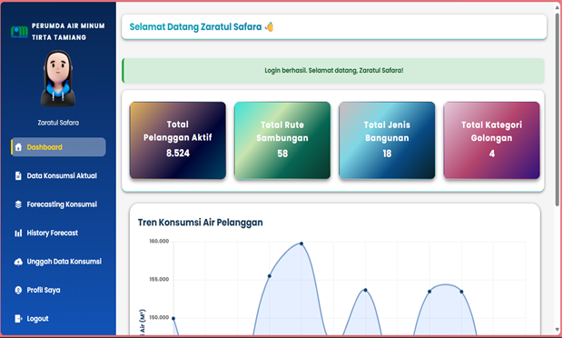
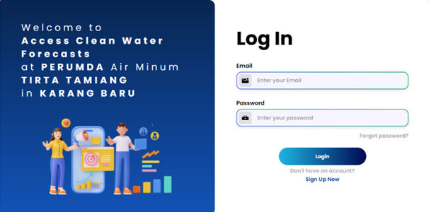
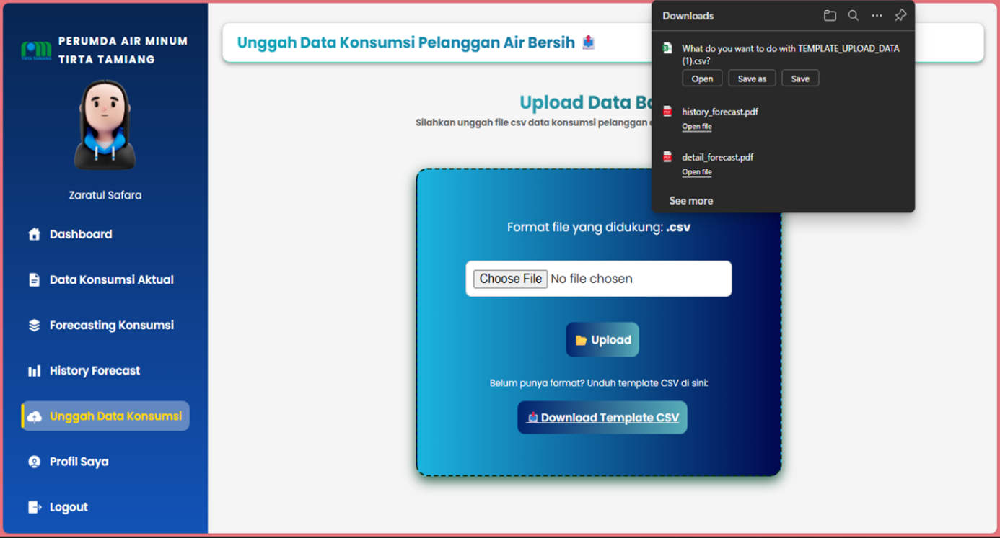
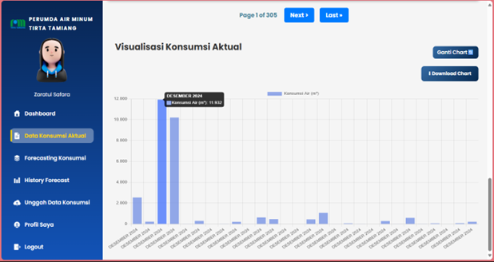
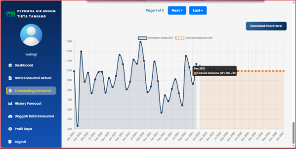
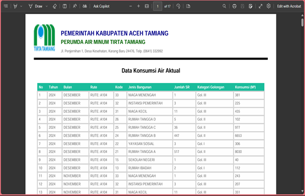

# Water Consumption Forecasting — Web Application

Web-based dashboard for forecasting clean water consumption 
at PERUMDA Air Minum Tirta Tamiang using the ARIMA method.

## Features
- ARIMA-based forecasting by customer category & distribution route
- Interactive dashboard with forecast visualization
- User authentication (login, register, email verification)
- Data upload via CSV
- Forecast history

## Tech Stack
- **Backend:** Python, Flask, SQLAlchemy
- **Frontend:** HTML, CSS, JavaScript, Bootstrap
- **Database:** SQLite
- **Method:** ARIMA (statsmodels)

## Background
Undergraduate thesis — Universitas Malikussaleh (2026).

## Author
Rehan Zubaidari — Information Systems, Universitas Malikussaleh
rehanzubaidari@gmail.com

## Screenshots

### Dashboard

### Login Page

### Upload Data

### Actual Consumption Data

### Forecasting Results

### Download Consumption Data

